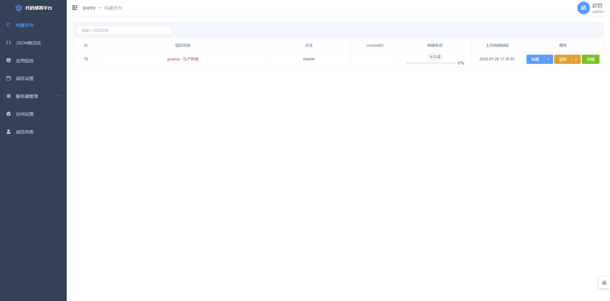

<p align=center>
    
</p>

<p align="center">
  <a href="#">
      
  </a>
  <a href="#">
      
    </a>
  <a href="LICENSE">
    
  </a>
</p>

English | [简体中文](./README.zh-CN.md)

Name: go + deploy

A web deployment system tool!

Support all kinds of code release and rollback, which can be done through the web with one click!

Complete installation instructions, no difficulty in getting started!

> Important note: The master branch may be in an unstable or unavailable state during the development process. Please use releases instead of master to obtain stable binary files.

[DEMO](http://49.234.66.193:3000) admin:admin!@# (It may not be able to open, depending on the mood)

[Document](https://zhenorzz.gitee.io/goploy)

## Content

- [Background](#Background)
- [Install](#Install)
- [Use](#Use)
- [Preview](#Preview)
- [Diagram](#Diagram)
- [Reverse proxy](#Reverse proxy)
- [Backend development instructions](#Backend development instructions)
- [Frontend development instructions](#Frontend development instructions)
- [Repository](#Repository)
- [Contribute](#Contribute)
- [License](#License)

## Background
Although most popular publishing tools are powerful, they are cumbersome to configure, difficult to get started, and difficult to use for projects.

## Install
1. Install mysql
2. Download the latest release

## Use
1. Run ./goploy or goploy.exe or goploy.mac
2. Follow the installation guide
3. web http://ip:port  (Account:Password admin:admin!@#)

## Preview


## Diagram


## Reverse proxy
Nginx reverse proxy remember to upgrade the ws protocol
```nginx
proxy_set_header Upgrade         $http_upgrade;
proxy_set_header Connection      "upgrade";
```

## Backend development instructions
1. Install go >= 1.13
2. go mod required
3. go run main.go
4. use gin (hot reload)

## Frontend development instructions
1. cd web
2. vi .env.development
3. npm run dev

## Repository

- [gin](https://github.com/codegangsta/gin) - GO hot reload。
- [element-ui](https://github.com/ElemeFE/element) - UI。

## Contribute

[Issue](https://github.com/zhenorzz/goploy/issues/new) 

Create a pull request.

## License

[MIT](LICENSE) © zhenorzz
