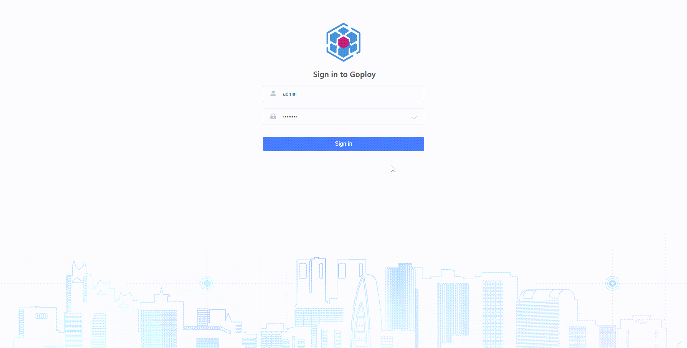
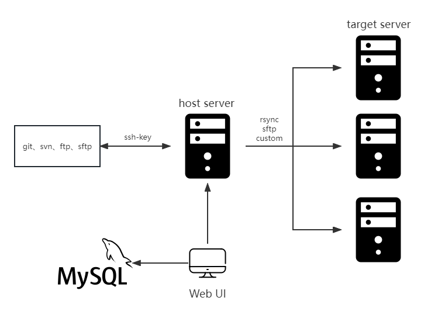

<p align=center>
    
</p>

<p align="center">
  <a href="#">
      
  </a>
  <a href="#">
      
    </a>
  <a href="LICENSE">
    
  </a>
</p>

English | [简体中文](./README.zh-CN.md)

Name: go + deploy

A web deployment system tool!

Support all kinds of code release and rollback, which can be done through the web with one click!

Complete installation instructions, no difficulty in getting started!

> Important note: The master branch may be in an unstable or unavailable state during the development process. Please use releases instead of master to obtain stable binary files.

[DEMO](http://demo.goploy.icu) admin:admin!@# (It may not be able to open, depending on the mood)

[Docker](https://hub.docker.com/r/zhenorzz/goploy)

[Dockerfile](./docker/Dockerfile)

[Document](https://docs.goploy.icu)

[OpenAPI](https://api-doc.goploy.icu)

[Goploy-Agent](https://github.com/zhenorzz/goploy-agent) Monitor server performance

[Goploy-Vscode](https://github.com/goploy-devops/goploy-vscode) Search Goploy in Visual Studio Code

[Goploy-Jetbrains](https://github.com/goploy-devops/goploy-jetbrains) Search Goploy in Jetbrains

[Jetbrains](https://www.jetbrains.com/?from=zhenorzz/goploy) Supports this project with GoLand licenses. We appreciate their support for free and open source software!

## Content

- [Feature](#Feature)
- [Install](#Install)
- [Use](#Use)
- [Preview](#Preview)
- [Diagram](#Diagram)
- [Backend](#Backend)
- [Frontend](#Frontend)
- [Repository](#Repository)
- [Contribute](#Contribute)
- [License](#License)

## Feature

Use Goploy to automate your development workflow, so you can focus on work that matters most. 

Goploy is commonly used for:

- Building projects
- Support git svn ftp sftp
- Deployment across os
- RBAC
- Monitor http tcp ping process script server
- Second cron 
- Xterm
- Sftp
- LDAP

## Install

via [release](https://github.com/zhenorzz/goploy/releases)

or build from tag
```
git clone https://github.com/zhenorzz/goploy.git
cd ./goploy
git checkout -b tagname
cd ./web
npm install && npm run build
cd ../
go build -o goploy cmd/server/main.go
```

## Use
1. Run ./goploy or goploy.exe or goploy.mac
2. Follow the installation guide
3. web http://ip:port  (Account:Password admin:admin!@#)

## Preview


## Diagram


## Backend
1. Install go >= 1.16
2. go mod required
3. edit goploy.toml `cp goploy.example.toml goploy.toml`
4. build [Frontend](#Frontend)
5. run `cd cmd/server && go run main.go --asset-dir=../../`
6. use gin (hot reload)

## Frontend
1. `cd web`
2. `npm install` or `yarn install`
3. edit .env.development
4. `npm run dev` or `yarn dev`
5. build `npm run build` or `yarn build`

## Contact

[Email](mailto:zhenorzz@gmail.com)

## Contribute

[Issue](https://github.com/zhenorzz/goploy/issues/new) 

Create a pull request.

## License

[GPLv3](LICENSE) © zhenorzz
