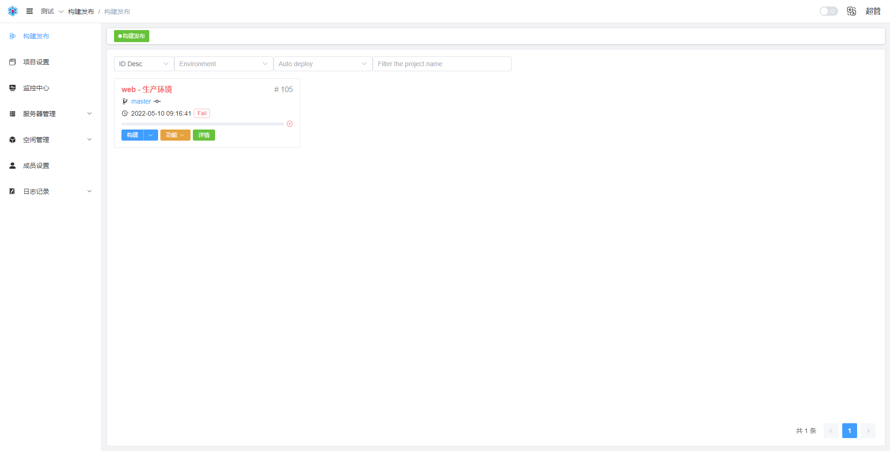
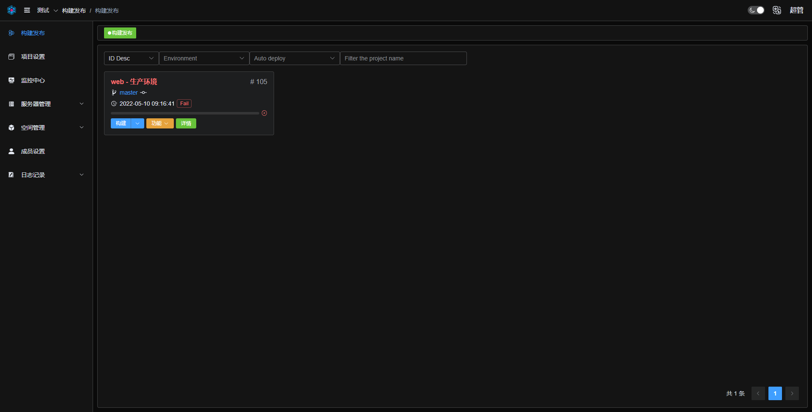

    

  
  
  

[English](./README.md)| 简体中文

名字来源：go + deploy

一个web部署系统工具!

支持各种代码发布、回滚，可以通过web来一键完成！

完整的安装指引，上手无难度！

> 重要提示: master 分支在开发过程中可能处于不稳定或者不可用状态，请通过releases而非master去获取稳定的二进制文件。

[DEMO](http://demo.goploy.icu) admin:admin!@# (不一定能打开，看心情)

[Docker](https://hub.docker.com/r/zhenorzz/goploy)

[Dockerfile](./docker/Dockerfile)

[帮助文档](https://docs.goploy.icu)

[Goploy-Agent](https://github.com/zhenorzz/goploy-agent) 监控服务器性能

## 内容列表

- [功能](#功能)
- [安装](#安装)
- [使用](#使用)
- [预览](#预览)
- [原理图](#原理图)
- [后端开发说明](#后端开发说明)
- [前端开发说明](#前端开发说明)
- [相关仓库](#相关仓库)
- [如何贡献](#如何贡献)
- [使用许可](#使用许可)

## 功能

Use Goploy to automate your development workflow, so you can focus on work that matters most.

Goploy 用于:

- 构建项目
- 发布项目到unix、windows
- 支持git、svn、ftp、sftp
- 基于角色的访问控制RBAC
- 监控http、tcp、process
- 服务器性能
- 秒级定时任务
- Xterm
- Sftp
- LDAP

## 安装
1. 安装mysql
2. 下载最新的release

## 使用
1. 运行./goploy or goploy.exe or goploy.mac (运行不了可能需要 chmod a+x, 再不行就发issue或加群)
2. 根据安装指引填入相关的配置
3. web http://ip:port  (账号:密码 admin:admin!@#)

## 预览

## 原理图

## 后端开发说明
1. 安装go，必须是1.16以上
2. 项目使用 go mod 管理
3. 修改 goploy.toml `cp goploy.example.toml goploy.toml`
4. 运行 `go run main.go --asset-dir=./` (需要编译一次前端，国内建议使用代理)
5. 或者使用 gin（可以热更新代码，改变就生效）

## 前端开发说明
1. `cd web`
2. `npm install` 或者 `yarn install`
3. 修改 .env.development
4. `npm run dev` 或者 `yarn dev`

## 相关仓库

- [element-plus](https://element-plus.gitee.io/) - UI。

## 捐赠

如果你觉得这个项目帮助到了你，你可以请作者喝一杯奶茶表示鼓励 🥛

  
  

## 如何贡献

非常欢迎你的加入! QQ群903750786，群里有基础安装视频。

[提一个Issue](https://github.com/zhenorzz/goploy/issues/new) 

提交一个 Pull Request.

## 使用许可

[GPLv3](LICENSE) © zhenorzz
